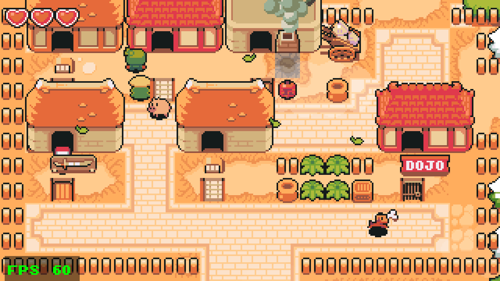
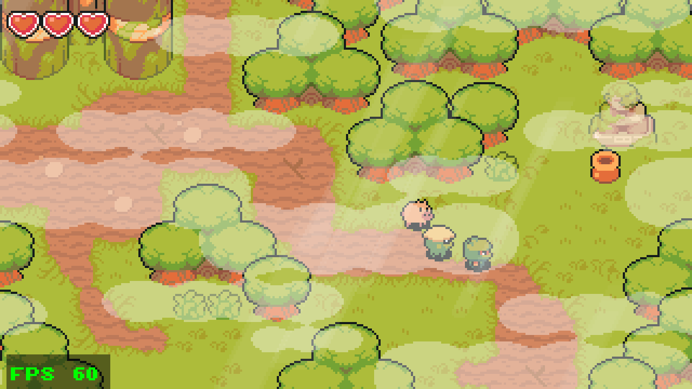
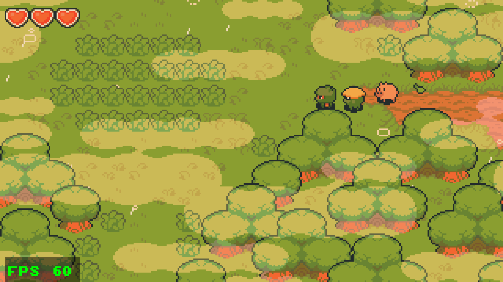
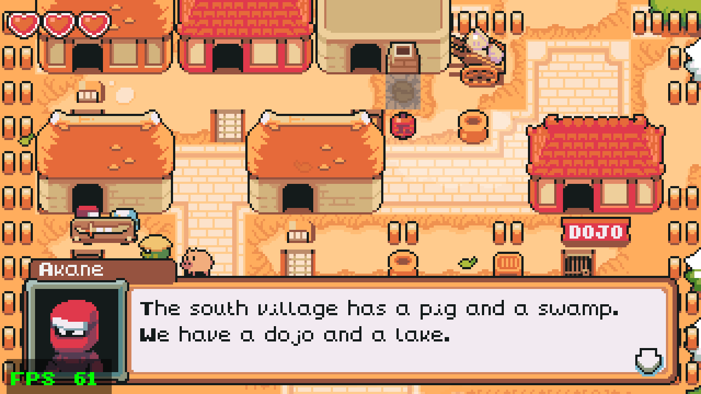
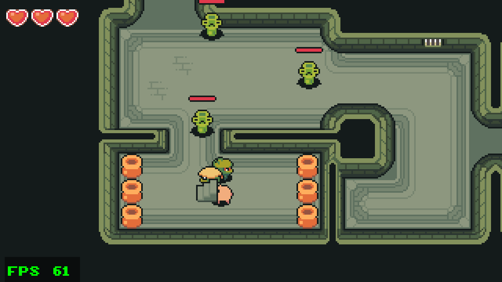

# ninja-adventure-indigo

[](AI-DECLARATION.md)
[](https://github.com/rinn7e/ninja-adventure-indigo/actions/workflows/pages.yml)

**▶ [Play it in your browser](https://rinn7e.com/ninja-adventure-indigo/)** (keyboard or gamepad; click the page
first, then press Space)

A clone of **[Ninja Adventure](https://pixel-boy.itch.io/ninja-adventure-asset-pack)**, the demo
game Pixel-boy made in Godot for his free asset pack, rewritten in **Scala 3** with
**[Indigo](https://indigoengine.io)** `0.30.0-M6`, a purely functional game engine that compiles
to JavaScript (Scala.js) and runs in the browser or as a desktop app.

It is built on top of
**[indigo-game-starter-template](https://github.com/rinn7e/indigo-game-starter-template)**: same
build, same TEA-style structure (The Elm Architecture: `Model` / `Msg` / `update` / `ui` per
scene), same conventions. Read the template's README first; this one only covers what's specific
to this game.

**The goal is to showcase how the Indigo engine works on a real game**, with the art and design
of a known one: tile maps, collision, a moving camera, characters and monsters, combat,
dialogue, weather, shaders, music and input, all written as pure functions of a model and the
clock. Both versions of the Godot demo are merged into one world: the Godot 4 demo's village,
and north of it, through a path in the forest, the older Godot 3 demo's whole world, each matched
as closely as possible.

<p align="center">
  
  <br><sub>The Godot 3 demo's village, reached from the Godot 4 one through the forest</sub>
</p>

<table>
  <tr>
    <td width="50%"><br><sub>The Godot 4 village: followers, props, light rays</sub></td>
    <td width="50%"><br><sub>The swamp: rain with splashes, fog, colour grading shader</sub></td>
  </tr>
  <tr>
    <td width="50%"><br><sub>Villagers and the dialogue box</sub></td>
    <td width="50%"><br><sub>The dungeon and its Bamboo monsters</sub></td>
  </tr>
</table>

## What it shows about Indigo

| Topic | How | Where to look |
| --- | --- | --- |
| Program structure | One Indigo `Game`, routing between scenes TEA-style (no Indigo `Scene`s) | `game/src/game/Main.scala`, `Update.scala` |
| Big tile maps, fast | ~8,000 tiles as instanced `CloneTiles` in static batches, y-sorted by row with the characters | `scene/worldscene/subui/TilemapUI.scala` |
| Collision | Circle bodies sliding along exact tile polygons (Indigo's geometry types), with a spatial index | `common/util/Collision.scala`, `common/constant/WorldMap.scala` |
| Game logic | Every frame a chain of pure `Model => Model` steps; sounds come out as events in the `Outcome` | `scene/worldscene/Update.scala` |
| Effects without state | Particles, fades, camera slides and routines computed from the clock, not simulated | `scene/worldscene/subui/WeatherUI.scala`, `ActorsUI.scala` |
| Custom shader | A blend shader on its own layer grading the whole screen | `ui/ColorGradingUI.scala` |
| Audio | Music cross-fades with `SceneAudio`, sound effects with `PlaySound` | `scene/worldscene/UI.scala`, `Update.soundsOf` |
| Input | Keyboard and gamepad, as Godot's `Input.get_vector` | `common/util/Input.scala` |
| Any window size | Whole-number scaling and letterboxing, per layer | `common/util/Screen.scala`, `Main.mainUI` |
| Assets from another engine | A pure-Python importer reading Godot 3 and Godot 4 scenes | `game/tools/import_godot.py`, `godot3.py` |
| Tests | Pure functions, so logic is tested without the engine running | `game/test/src/game/` |

## What's in it

From the **Godot 4 demo**:

- **The village map**, imported tile for tile (5 tilesets, 4 layers, exact collision polygons,
  y-sorting and z-indexes).
- **Characters** with Godot's movement and move-and-slide collision: the player, a follower, a
  wandering pig, and a patrolling guard.
- **Breakable grass, pots and crates**, the **screen-by-screen camera**, **house doors** with a
  fade, and the **hearts HUD**.
- **Environment zones**: weather (rain with splashes, fog, clouds, leaves, light rays), music with
  a fade, and colour grading (the swamp's gradient shader).
- **Keyboard and gamepad** input, as in Godot's input map.

From the **Godot 3 version** (its world lies north of the Godot 4 village):

- **Its whole map**, imported from its Godot 3 tile maps: the autumn village with its houses and
  dojo, the lake, the snowy corner, the rainy forest, a house interior and the dungeon, with
  their doors.
- **Villagers** with their idle routines, a speech bubble in talking range, and a **dialogue
  box** with their portraits (their lines are ours: the Godot 3 project's dialogue files aren't
  in it).
- **Combat**: the lance (hold Space, 3 damage), six Bamboo monsters (in the dungeon and the rainy
  forest) that wander, hurt and knock you back; death and revival, draining hearts, monsters and
  props coming back when you change screen; hit and break sounds; the controls tutorial.
- **Its music** (one track per area), **breakable plants** and **smoke** plumes.

Combined:

- Both worlds use the Godot 4 systems: environment zones (music, weather, grading) cover the
  Godot 3 areas too, which brings the Godot 4 demo's unused **snow** to life, plus Godot 3's
  **sparks**.
- The Godot 4 village's open north edge now leads, through a gap in the forest, to the Godot 3
  village; every other edge that opened onto nothing is walled.

Added for this port:

- **Letterboxing**: the 320x180 view is scaled by the largest whole number that fits the window
  and centred with black bars, in the browser and the desktop build alike.
- **A title screen**, since a browser only plays music after a key press.

## Controls

| Input | Action |
| --- | --- |
| Arrows / WASD, D-pad, left stick | Walk |
| Space, Cross (A) | Talk to a villager next to you, or attack (hold to keep stabbing); start |
| Enter / Z | Talk, next line; start the game from the title |
| Options (Start) | Start the game from the title |
| F3 | Show the player's position (for development) |

## Running it

Requirements and commands are the template's
([Requirements](https://github.com/rinn7e/indigo-game-starter-template#requirements),
[Commands](https://github.com/rinn7e/indigo-game-starter-template#commands)); the code is the
`game` module in `game/src/game/`, as in the template:

```bash
./mill game.test          # unit tests
./mill game.indigoBuild   # build the site into out/game/indigoBuild.dest
./mill game.indigoRun     # desktop app (Electron)
./mill game.indigoBuildFull  # the optimised build, as published to GitHub Pages
python3 -m http.server 8787 --directory out/game/indigoBuild.dest
```

## Re-importing from the Godot projects

Everything the game needs is in the repository: the images, sounds and music in
`game/assets/`, and the map in `game/src/game/common/constant/VillageTiles.scala`, both
written by `game/tools/import_godot.py` (pure Python). To re-run it, put the Godot 4 demo
(<https://github.com/pixel-boy/NinjaAdventure>) in `assets/NinjaAdventure Godot V4/` and the
Godot 3 version in `assets/NinjaAdventure Godot V3/`, then:

```bash
python3 game/tools/import_godot.py
```

Neither Godot project is included here (see [Credits](#credits)).

## Docs

- **[doc/porting-from-godot.md](doc/porting-from-godot.md)**: each part of the Godot demos and its
  Indigo counterpart, the TileMap encoding, and the draw order.
- **[doc/code-convention.md](doc/code-convention.md)**: what this project adds to the template's
  conventions.
- **[doc/development-note.md](doc/development-note.md)**: build gotchas, and how to check a change.
- **[doc/functional-game-dev.md](doc/functional-game-dev.md)**: what porting a Godot game to a
  functional engine was like: what got better, what got harder, and the surprises.
- **[doc/advanced-indigo-features.md](doc/advanced-indigo-features.md)**: Indigo features this game
  doesn't use yet (performers, signals, clips, automata, subsystems), to be tested in a larger game.

**Where to start in the code:** `game/src/game/scene/worldscene/Update.scala` is the game
logic; the rest follows the template's layout (`common/constant/Village.scala`,
`NorthVillage.scala` and `Combat.scala` hold the numbers taken from Godot).

## Credits

- Art, music, sounds and font: the [Ninja Adventure asset pack](https://pixel-boy.itch.io/ninja-adventure-asset-pack)
  by [Pixel-boy](https://pixel-boy.itch.io/) and [AAA](https://www.instagram.com/challenger.aaa/),
  released under [CC0](assets/Ninja%20Adventure%20-%20Asset%20Pack/LICENSE.txt) (included in
  `assets/`). Support them on [Patreon](https://www.patreon.com/pixelarchipel).
- Game design, map and behaviour: the Ninja Adventure Godot 4 demo by Pixel-boy,
  <https://github.com/pixel-boy/NinjaAdventure>. This project is an independent re-implementation
  in Scala; the demo's scripts and scenes are not redistributed.
- Nine images in `game/assets/` come from that demo rather than the pack: `crate`, `pot`, `grass`,
  `pig`, `shadow`, `fx_cloud`, `fx_fog`, `fx_rain` and `tileset_animated`. They are the same
  author's versions of the pack's art, made for the demo; the demo repository states no licence.
- The Godot 3 version of the demo, MIT licence, © 2020 Emilio Coppola: its map, villagers,
  combat and effects are ported here, and the files it adds to the pack's art (`v3_tileset_*`,
  `monster_bamboo`, `weapon_lance`, `fx_impact`, `fx_spark`, `fx_smoke`, `life_bar_mini_*`,
  `tutorial`, `dialog_*`, `npc_*`, `face_*`, `plant`, `snd_hit`, `snd_grass`) are copied into
  `game/assets/`.

## Changelog

See [CHANGELOG.md](CHANGELOG.md).

## AI declaration

This project declares its AI usage in [AI-DECLARATION.md](AI-DECLARATION.md), following the
[AI-DECLARATION.md](https://ai-declaration.md) standard (level: `pair`).

## License

The code is [MIT](LICENSE). The assets keep their own terms: the asset pack in `assets/` and the
files copied from it into `game/assets/` are CC0; see [Credits](#credits) for the files taken
from the Godot demos.
