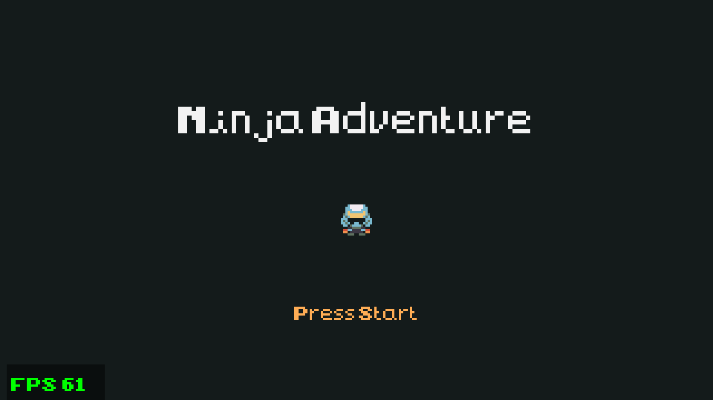
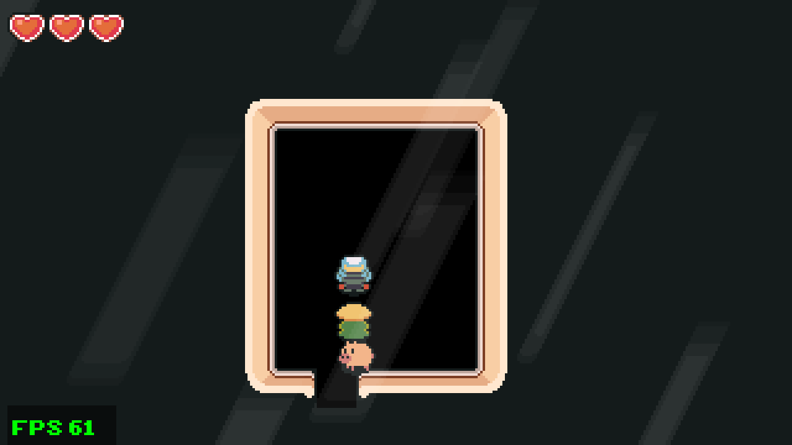

# ninja-adventure-indigo

A port of the [Ninja Adventure](https://pixel-boy.itch.io/ninja-adventure-asset-pack) Godot demo
to [Indigo](https://indigoengine.io) `0.30.0-M6`, a purely functional game engine for Scala 3 /
Scala.js. It is built on
**[indigo-game-starter-template](https://github.com/rinn7e/indigo-game-starter-template)**: same
build, same TEA-style structure, same conventions. Read the template's README first; this one only
covers what's specific to this game.

The aim is to match the original as closely as possible: the Godot 4 demo's map, characters,
collision, camera, weather, colour grading and music, at the same 320x180 resolution, plus the
combat from the older Godot 3 version of the demo.

## Screenshots

| Title | Village | Swamp | House |
| --- | --- | --- | --- |
|  |  |  |  |

## What's in it

From the **Godot 4 demo**:

- **The village map**, imported tile for tile (5 tilesets, 4 layers, exact collision polygons,
  y-sorting and z-indexes).
- **Characters** with Godot's movement and move-and-slide collision: the player, a follower, a
  wandering pig, and a patrolling guard.
- **Breakable grass, pots and crates**, the **screen-by-screen camera**, **house doors** with a
  fade, and the **hearts HUD**.
- **Environment zones**: weather (rain with splashes, fog, clouds, leaves, light rays), music with
  a fade, and colour grading (the swamp's gradient shader).
- **Keyboard and gamepad** input, as in Godot's input map.

From the **Godot 3 version** (which has the combat V4 lacks):

- **The lance**: hold Space to stab (3 damage).
- **Bamboo monsters** that wander, hurt and knock you back, with life bars, in the meadow
  north-east of the start.
- **Death and revival**, draining hearts, monsters and props coming back when you change screen,
  sounds, and the controls tutorial.

Added for this port:

- **Letterboxing**: the 320x180 view is scaled by the largest whole number that fits the window
  and centred with black bars, in the browser and the desktop build alike.
- **A title screen**, since a browser only plays music after a key press.

## Controls

| Input | Action |
| --- | --- |
| Arrows / WASD, D-pad, left stick | Walk |
| Space, Cross (A) | Attack (hold to keep stabbing); start the game from the title |
| Enter / Z, Options (Start) | Start the game from the title |

## Running it

Requirements and commands are the template's
([Requirements](https://github.com/rinn7e/indigo-game-starter-template#requirements),
[Commands](https://github.com/rinn7e/indigo-game-starter-template#commands)), with the module
named `ninja` instead of `game`:

```bash
./mill ninja.test          # unit tests
./mill ninja.indigoBuild   # build the site into out/ninja/indigoBuild.dest
./mill ninja.indigoRun     # desktop app (Electron)
python3 -m http.server 8787 --directory out/ninja/indigoBuild.dest
```

## Re-importing from the Godot projects

Everything the game needs is in the repository: the images, sounds and music in
`ninja/assets/`, and the map in `ninja/src/ninja/common/constant/VillageTiles.scala`, both
written by `ninja/tools/import_godot.py` (pure Python). To re-run it, put the Godot 4 demo
(<https://github.com/pixel-boy/NinjaAdventure>) in `assets/NinjaAdventure Godot V4/` and the
Godot 3 version in `assets/NinjaAdventure Godot V3/`, then:

```bash
python3 ninja/tools/import_godot.py
```

Neither Godot project is included here (see [Credits](#credits)).

## Docs

- **[doc/porting-from-godot.md](doc/porting-from-godot.md)**: each part of the Godot demos and its
  Indigo counterpart, the TileMap encoding, and the draw order.
- **[doc/code-convention.md](doc/code-convention.md)**: what this project adds to the template's
  conventions.
- **[doc/development.md](doc/development.md)**: build gotchas, and how to check a change.

**Where to start in the code:** `ninja/src/ninja/scene/worldscene/Update.scala` is the game
logic; the rest follows the template's layout (`common/constant/Village.scala` and `Combat.scala`
hold the numbers taken from Godot).

## Credits

- Art, music, sounds and font: the [Ninja Adventure asset pack](https://pixel-boy.itch.io/ninja-adventure-asset-pack)
  by [Pixel-boy](https://pixel-boy.itch.io/) and [AAA](https://www.instagram.com/challenger.aaa/),
  released under [CC0](assets/Ninja%20Adventure%20-%20Asset%20Pack/LICENSE.txt) (included in
  `assets/`). Support them on [Patreon](https://www.patreon.com/pixelarchipel).
- Game design, map and behaviour: the Ninja Adventure Godot 4 demo by Pixel-boy,
  <https://github.com/pixel-boy/NinjaAdventure>. This project is an independent re-implementation
  in Scala; the demo's scripts and scenes are not redistributed.
- Nine images in `ninja/assets/` come from that demo rather than the pack: `crate`, `pot`, `grass`,
  `pig`, `shadow`, `fx_cloud`, `fx_fog`, `fx_rain` and `tileset_animated`. They are the same
  author's versions of the pack's art, made for the demo; the demo repository states no licence.
- Combat: the Godot 3 version of the demo, MIT licence, © 2020 Emilio Coppola. Its combat logic is
  ported here, and its assets (`monster_bamboo`, `weapon_lance`, `fx_impact`, `life_bar_mini_*`,
  `tutorial`, `snd_hit`, `snd_grass`) are copied into `ninja/assets/`.

## Changelog

See [CHANGELOG.md](CHANGELOG.md).

## License

The code is [MIT](LICENSE). The assets keep their own terms: the asset pack in `assets/` and the
files copied from it into `ninja/assets/` are CC0; see [Credits](#credits) for the files taken
from the Godot demos.
